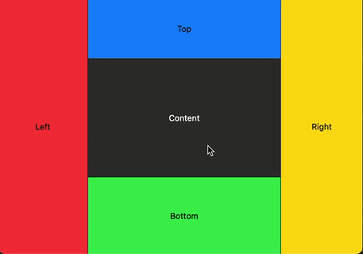

# ResizableView
This Swift package offers a SwiftUI view designed for resizing, making it ideal for managing window panes in macOS applications.


## Installation:
Add the package and desired version to your project:
```
https://github.com/andylindebros/ResizableView
```

## Implementation

``` Swift
ResizableView(size: Binding<CGFloat>, side: .trailing) {
    Your content
}
```

Available resizable sides:

``` Swift
enum Side {
    case leading, trailing, top, bottom
}
```

Example:

``` Swift
struct ContentView: View {
    @State var leftPaneWidth: CGFloat = 100
    @State var rightPaneWidth: CGFloat = 100
    @State var topPaneHeight: CGFloat = 100
    @State var bottomPaneHeight: CGFloat = 100
    var body: some View {
        HStack(spacing: 0) {
            ResizableView(size: $leftPaneWidth, side: .trailing) {
                VStack {
                    Text("Left")
                }
                .frame(maxWidth: .infinity, maxHeight: .infinity)
                .background(Color.red)
            }
            VStack(spacing: 0) {
                ResizableView(size: $topPaneHeight, side: .bottom) {
                    VStack {
                        Text("Top")
                    }
                    .frame(maxWidth: .infinity, maxHeight: .infinity)
                    .background(Color.blue)
                }

                VStack {
                    Text("Content")
                        .foregroundStyle(.white)
                }.frame(maxWidth: .infinity, maxHeight: .infinity)

                ResizableView(size: $bottomPaneHeight, side: .top) {
                    VStack {
                        Text("Bottom")
                    }
                    .frame(maxWidth: .infinity, maxHeight: .infinity)
                    .background(Color.green)
                }
            }
            ResizableView(size: $rightPaneWidth, side: .leading) {
                VStack {
                    Text("Right")
                }
                .frame(maxWidth: .infinity, maxHeight: .infinity)
                .background(Color.yellow)
            }
        }
        .foregroundStyle(.black)
    }
}
```
